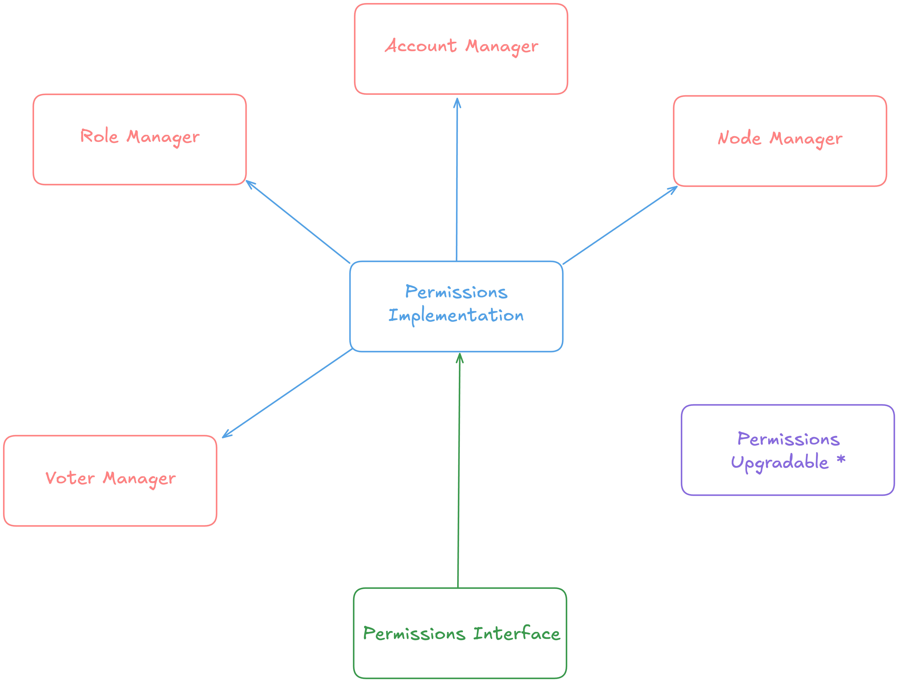

# Introduction

This document aims to be a simple guide to help understand the smart contract
architecture of a Go Quorum network. While it briefly references off-chain
actions for context, its primary focus is on the smart contracts and their
interactions.

This guide begins with an overview of the purpose of each contract, followed by
a summary of the status codes defined within them. Next, it outlines the
deployment process, discusses key configuration files, and provides a detailed
exploration of the `PermissionsImplementation` contract.

In the Go Quorum suite, the `PermissionsImplementation` contract plays a central
role, as most interactions pass through it. For this reason, the
`PermissionsImplementation` contract is described in detail.

## Starting Notes

The Go Quorum smart contracts were written when smart contract design patterns,
features, and open-source libraries differed significantly from today’s standards.
Although a "modern" version of these contracts would look quite different, a
complete rewrite was beyond the scope of this project. Having said that, the
original contracts contained minor documentation errors and were formatted in a
way that made readability challenging.

To address this, we have updated the documentation, reformatted the code, and made
small adjustments to better suit our use case. Aside from the adjustments listed
below, we have not altered any implementation logic.

Since the contracts’ API must remain compatible with off-chain services, these
adjustments were made carefully to preserve the existing API. In a greenfield
project, some design decisions would have differed.

## Overview of Logic Changes

The original contracts allowed for multiple accounts to be linked to the Network
Administrator organisation and be assigned the Network Administrator role. We
have adjusted the contracts to allow for only _a single account_ to be linked to
the Network Administrator organisation and be assigned the Network Administrator
role.

We have also removed the ability to create additional organisation admins, meaning
that the only admin on the network will be the original Network Admin.

Affected functions:

-   `PermissionsImplementation.addAdminAccount`: Added a check that ensures there
    can only be one Network Admin.

-   `PermissionsImplementation.addOrg`: Assigned the Network Admin as the Org Admin
    of the organisation being adding, removed setting the passed in account address
    as an Org Admin.

-   `PermissionsImplementation.approveOrg`: Removed assigning the passed in account
    as an Org Admin.

-   `PermissionsImplementation.assignAdminRole`: Added a check to ensure that
    only the Network Admin role can be assigned.

-   `PermissionsImplementation.approveAdminRole`: There were a number changes to
    this function. A check was added to make sure that the account being approved
    is actually the subject of an active vote. As we have made a decision that there
    can only be one Network Admin, we have added logic to ensure that the previous
    admin is removed from the voter list, revoked of its admin role and replaced
    with the new admin.

-   `PermissionsImplementation.assignAccountRole`: Added logic to ensure that the
    account being changed is not the active Network Admin. This means that the
    active Network Admin cannot be demoted with this function.

# General Overview of Contracts


> Note: This map is a simplified representation of the relationships between the
> contracts. It focuses on illustrating the connections between the `PermissionsInterface`,
`PermissionsImplementation`, and Manager contracts. For details on the
`PermissionsUpgradeable` contract, please refer to the deployment guide.

## AccountManager

Holds the implementation logic for all account management on the network. It is
called into only by the `PermissionsImplementation` contract. All accounts on the
network are assigned an "account status" - an integer value from zero to seven (0-7).
A description of these values are provided in the following section.

## NodeManager

Holds the implementation logic for all node management functionality. It is
called into only by the `PermissionsImplementation` contract. All nodes on the
network are assigned a "node status" - an integer value from zero to five (0-5).
A description of these values are provided in the following section.

## OrgManager

Holds the implementation logic for all org management functionality. It is called
into only by the `PermissionsImplementation` contract. All orgs on the
network are assigned an "org status" - an integer value from zero to four (0-4).
A description of these values are provided in the following section.

## PermissionsImplementation

Contains the implementation logic for the network permissions system. It can
only be interacted with by the `PermissionsInterface` contract.

## PermissionsInterface

This contract is the interface for the Permissions Implementation contract. Not
to be confused with an actual Solidity interface, this contract forwards calls
to the `PermissionsImplementation` contract.

## PermissionsUpgradable

This contract holds the address of current `PermissionsImplementation` contract.
This contract is owned by a Guardian account. Only the Guardian account can
change the `PermissionsImplementation` contract address.

## RoleManager

This contract holds the implementation logic for all role management
functionality. It can only be called into by the `PermissionsImplementation`
contract. The `RoleManager` contract establishes "base access" roles - represented
as an integer value from zero to seven (0-7). A description of these values are
provided in the following section.

## VoterManager

This contract holds the implementation logic for all account voter and voting
functionality. It can only be called into by the `PermissionsImplementation`
contract. Each voting record has an attribute operation type (`opType`) which
denotes the activity type that is pending approval. The Operation Types are
provided in the following section.

# Statuses By Contract

## Account Manager

-   0: Not in list
-   1: Account pending approval
-   2: Active
-   3: Inactive
-   4: Suspended
-   5: Blacklisted
-   6: Revoked
-   7: Recovery Initiated for blacklisted accounts and pending approval from network admins

## NodeManager

-   0: Not in list
-   1: Node pending approval
-   2: Active
-   3: Deactivated
-   4: Blacklisted
-   5: Blacklisted node recovery initiated. Once approved the node status will be updated to Active (2)

## OrgManager

-   0: Not in list
-   1: Org proposed for approval by network admins
-   2: Org is Approved
-   3: Org proposed for suspension and pending approval by network admins
-   4: Org is Suspended

## RoleManager

-   0: Read only
-   1: Value transfer
-   2: Contract deploy
-   3: Full access
-   4: Contract call
-   5: Value transfer and contract call
-   6: Value transfer and contract deploy
-   7: Contract call and deploy

## VoterManager

-   0: None - indicates no pending records for the org
-   1: New org add activity
-   2: Org suspension activity
-   3: Revoke of org suspension
-   4: Assigning admin role for a new account
-   5: Blacklisted node recovery
-   6: Blacklisted account recovery

# Order of Deployments and Setup

1.  Deploy Permissions Upgradeable
    -   Requires an account address that will be assigned as a "guardian".

2.  Deploy Org Manager
    -   Requires the `PermissionsUpgradeable` contract address.

3.  Deploy Role Manager
    -   Requires the `PermissionsUpgradeable` contract address.

4.  Deploy Account Manager
    -   Requires the `PermissionsUpgradeable` contract address.

5.  Deploy Voter Manager
    -   Requires the `PermissionsUpgradeable` contract address.

6.  Deploy Node Manager
    -   Requires the `PermissionsUpgradeable` contract address.

7.  Deploy Permissions Interface
    -   Requires the `PermissionsUpgradeable` contract address.

8.  Deploy Permissions Implementation
    -   Requires the `PermissionsUpgradeable` contract address.
    -   Requires the `OrgManager` contract address.
    -   Requires the `RolesManager` contract address.
    -   Requires the `AccountManager` contract address.
    -   Requires the `VoterManager` contract address.
    -   Requires the `NodeManager` contract address.

9.  After all contracts are deployed, call `PermissionsUpgradeable.init`.
    -   Requires the `PermissionsInterface` contract address.
    -   Requires the `PermissionsImplementation` contract address.
    -   This function sets the `PermissionsInterface` and `PermissionsImplementation`
        contract addresses inside itself.
    -   This function also sets up the `PermissionsImplementation` address inside
        the `PermissionsInterface` contract. It does so with a call to
        `PermissionsInterface.setPermImplementation`.

# A Note on Configuration Files

In Go Quorum, there are a set of configuration files that are shared among all
nodes on the network. These files help facilitate aspects of network management,
and include:

-   `disallowed-nodes.json`;
-   `genesis.json`;
-   `permission-config.json`;
-   `permissioned-nodes.json`; and
-   `static-nodes.json`.

For the purposes of this document, the `permissions-config.json` is especially
relevant. The structure of the file looks as follows:

```json
{
    "permissionModel": "v2",
    "upgradableAddress": "0x...",
    "interfaceAddress": "0x...",
    "implAddress": "0x...",
    "nodeMgrAddress": "0x...",
    "accountMgrAddress": "0x...",
    "roleMgrAddress": "0x...",
    "voterMgrAddress": "0x...",
    "orgMgrAddress": "0x...",
    "nwAdminOrg": "HAVEN1",
    "nwAdminRole": "ADMIN",
    "orgAdminRole": "ORGADMIN",
    "accounts": [
        "0x...",
        "0x..."
    ],
    "subOrgBreadth": 3,
    "subOrgDepth": 4
}

```

-   `permissionModel`: Permission model to be used (`v1` or `v2`).

-   `upgradableAddres`: Address of deployed contract `PermissionsUpgradable.sol`.

-   `interfaceAddress`: Address of deployed contract `PermissionsInterface.sol`.

-   `implAddress`: Address of deployed contract `PermissionsImplementation.sol`.

-   `nodeMgrAddress`: Address of deployed contract `NodeManager.sol`.

-   `accountMgrAddress`: Address of deployed contract `AccountManager.sol`.

-   `roleMgrAddress`: Address of deployed contract `RoleManager.sol`.

-   `voterMgrAddress`: Address of deployed contract `VoterManager.sol`.

-   `orgMgrAddress`: Address of deployed contract `OrgManager.sol`.

-   `nwAdminOrg`: Name of the initial organisation to be created as a part of the
    network boot up with a new permissions model. This organisation owns all the
    initial nodes and network administrator accounts at the network boot up.

-   `nwAdminRole`: Role ID to be assigned to the network administrator accounts.

-   `orgAdminRole`: Role ID to be assigned to the organisation administrator account.

-   `accounts`: Initial list of accounts linked to the network administrator
    organisation and assigned the network administrator role. These accounts have
    complete control of the network and can propose and approve new organisations
    into the network.

-   `subOrgBreadth`: Number of sub-organisations that any organisation can have.

-   `subOrgDepth`: Maximum depth of sub-organisation hierarchy allowed in the network.

For more detailed information, see the [configuration](https://docs.goquorum.consensys.io/configure-and-manage/configure/permissioning/enhanced-permissions)
and [management](https://docs.goquorum.consensys.io/configure-and-manage/manage/enhanced-permissions)
documentation.

# Permissions Implementation

This contract contains the implementation logic for the network permissions
system. It can only be interacted with by the `PermissionsInterface` contract
except for one function, `setMigrationPolicy`, which is called to from the
`PermissionsUpgradeable` contract.

Importantly, even though this contract is interacted with from the `PermissionsInterface`
contract, the execution context remains inside the `PermissionsImplementation`
contract.

The important state managed by the `PermissionsImplementation` contract are:

-   `adminOrg`;
-   `adminRole`; and
-   `orgAdminRole`.

If ever the `PermissionsImplementation` contract was to be replaced, the
`PermissionsUpgradeable` contract can initiate a migration via
`PermissionsUpgradeable.confirmImplChange`. For more details, see
`PermissionsImplementation.getPolicyDetails` and `PermissionsImplementation.setMigrationPolicy`.

## Policy Management

### General Initialisation

The `PermissionsImplementation` contract exposes a function called `init`. This
function can only be called by the `PermissionsInterface` during network
initialisation. Note that this function does a number of important tasks:

-   Sets the breadth and depth of allowable sub-organisations in the `OrgManager` contract;

-   Creates the admin org as the default organisation in the `OrgManager` contract;

-   Adds the Admin Role definition to the `RoleManager` contract, associates it
    with the Admin Org, grants it full access and makes it both a voter and admin; and

-   Sets the Network Admin role and Org Admin role in the `AccountManager` contract.

### Initial Admin Policies

The `PermissionsImplementation` contract exposes a function called `setPolicy`.
It sets the initial admin state (the Network Admin org, the Network Admin role,
and the Org Admin role).

`PermissionsImplementation.setPolicy` can only be called by the `PermissionsInterface`
contract at a time before the network boot has been completed (that is to say, during
network initialisation).

Before a policy is set (via `setPolicy`), there is no:

-   Network Admin Org;
-   Netowrk Admin Role; or
-   Org Admin Role.

Thus, an initial call to `getPolicyDetails` would return: `["", "", "", false]`.

An example call to `setPolicy` would look like:

```solidity
setPolicy(
    "HAVEN1"    // The Network Admin Org
    "ADMIN"     // The Network Admin Role
    "ORGADMIN"  // The Org Admin Role
);
```

### Adding an Admin Node

The `PermissionsImplementation` contract provides a function called
`addAdminNode`, which is responsible for adding nodes during the network
initialization phase. This function can only be invoked through the
`PermissionsInterface` contract and exclusively during the boot-up phase, before
the network is fully initialized.

This process ensures that all nodes specified in the `static-nodes.json` file are
registered as part of the Network Admin Organization. Each node is defined by
its enode ID, IP address, TCP port, and raft port.

### Adding an Admin Account

The `PermissionsImplementation` exposes a function called `addAdminAccount`.
This function is callable only via the `PermissionsInterface` contract, at a time
before the network boot has been completed.

We have made changes to this function such that only one Network Admin can exist.

To understand this process, we first need to understand a little bit about the
`AccountManager` contract. As explained above, the `AccountManager` contract
holds the implementation logic for all account management on the network.

One of the functions that `AccountManager` exposes is `getNumberOfAccounts`, which,
as the name suggests, returns the current number of accounts on the network.

The number of accounts obviously begins at zero (0), and the first account that
is added to the network is the Network Admin account. So if ever someone attempts
to add a Network Admin and `AccountManager.getNumberOfAccounts` is not zero (0),
then we revert.

After checking that there are no accounts yet registered,
`PermissionsImplementation.addAdminAccount` proceeds to add the account as a voter
on the `VoterManager` contract and as a Network Admin on the `AccountManager`
contract.

### Adding a New Organization

The `PermissionsImplementation` contract includes a function called `addOrg`,
which facilitates the process of adding a new organization to the network. This
function can only be executed through the `PermissionsInterface` contract and is
designed to maintain strict governance and consistency within the network's
administrative structure.

The addOrg function handles multiple tasks to ensure the new organization is
integrated into the network properly. These tasks include creating an
organization record, registering nodes, and initiating a voting process for
approval.

We have altered the function such that it now does not assign the `_account`
parameter as the organization admin because only one Network Admin is permitted.

### Approving an Organization

The `PermissionsImplementation` contract includes the `approveOrg` function,
which enables Network Admins to approve an organization that is pending approval.
This function ensures that the organization meets all necessary conditions and
has received the required votes for approval before finalizing the process.

As in the addOrg function, the `_account` parameter is not assigned as the
Organization Admin because only one Network Admin is allowed.

### Adding a New Role to an Organization

The `PermissionsImplementation` contract includes the `addNewRole` function,
which allows an Organization Admin to define a new role within their organization.
This function ensures that role definitions are securely managed and can only be
created by authorized administrators.

### Removing a Role from an Organization

The `PermissionsImplementation` contract includes the `removeRole` function,
which allows an Organization Admin to remove an existing role from their
organization. This function ensures that only non-essential roles can be removed
and enforces strict access controls to prevent unauthorized modifications.

### Assigning an Admin Role

The `PermissionsImplementation` contract includes the `assignAdminRole` function,
which enables Network Admins to assign the Network Admin role to an account.
This function ensures that the assignment of administrative privileges is tightly
controlled and executed through the proper governance process.

We have altered the logic in this funcion to ensure that only the Network Admin
role can be assigned.

### Approving Admin Role Assignment

The `PermissionsImplementation` contract includes the `approveAdminRole` function,
which allows Network Admins to finalize the assignment of the Network Admin or
Organization Admin role. This function enforces a thorough voting process,
ensuring that administrative roles are transferred transparently and securely.

The `approveAdminRole` function performs a multi-step process with strict
validations to approve and finalize an admin role assignment. We have added a
number of extra checks to this function:

-   A check was added to make sure that the account being approved is actually the
    subject of an active vote.

-   As we have made a decision that there can only be one Network Admin, we have
    added logic to ensure that the previous admin is removed from the voter list,
    revoked of its admin role and replaced with the new admin.

### Adding a Node to an Organization

The `addNode` function in the `PermissionsImplementation` contract allows an
Org Admin to add a new node to their organization. This function is critical
for expanding an organization's infrastructure while ensuring proper role-based
access control and governance.

### Updating a Node's Status

The `updateNodeStatus` function in the `PermissionsImplementation` contract
allows an Org Admin to change the status of a node within their organization.
This action provides flexibility in managing nodes, including deactivating,
activating, or blacklisting them.

### Assigning a Role to an Account

The `assignAccountRole` function allows an Org Admin to assign a specific role
to an account within their organization. We have added multiple checks to this
function to ensure that the role assignment is legitimate and that the
organization remains secure by preventing the active admin from being demoted.
